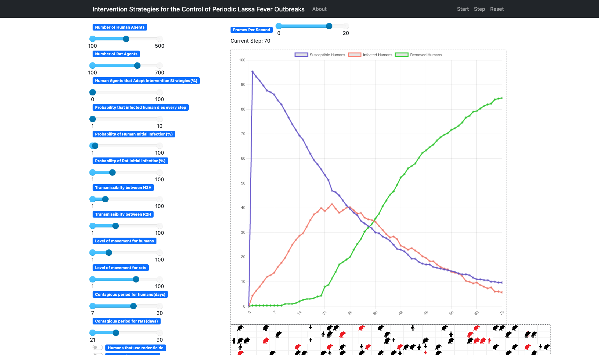
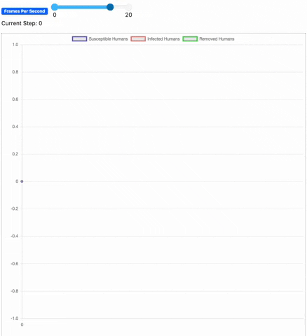

<H2 align="center"> Lassa Fever Agent Based Model</H2>

This is an epidemilogical stochastic agent-based model that runs locally in your browser. The model aims to simulate and visualize how infectious dieseases spread through a community. Developed by Daniel Quezada for [CSUF's CEDDI Lab](http://sampsonakwafuo.com/ceddi-lab) during URE22's summer program. 



## Getting Started ⚙️
To get started with this project, clone the repo with:
```
git clone https://github.com/DQ4781/Lassa-ABM.git
```

Then install the library requirements with:
```
pip install -r requirements.txt
```

To run the agent-based model, run the following command:
```
python3 lassa_run.py
```

## Background 🔍
Lassa Fever (LF) is a viral hemorrhagic fever that is endemic to West Africa
- Similar to Ebola, symptoms include:
  - Fever, headaches, nausea, facial swelling, internal bleeding, seizures, and coma
- LF has been shown to have a total case fatality rate of 26.5%

Multimammate rat (*mastomys natalensis*) is the most common host of LF
- Primarily responsible for transmission of LF into humans
- Annually responsible for 100-300k infections every year
- Up to 30% of total rat populations are infected with LF in West Africa

Both the CDC and WHO have designated LF as a virus for priority research and are actively monitoring the situtaion in West Africa
- Gavi Institution has hinted at the possibility that LF could evolve and become the next global pandemic
- Currently, there are no vaccines or vaccine candidates for LF

## Overview 📝
Data related to LF infections in Western Africa has been fitted to this model.

This model is broken up into two main parts:
1. **SIR Graph**
- (S)usceptible, (I)nfected, (R)ecovered graphs are a common epidemiological visualization representing how an infectious disease spreads through a population over time
- Keeps track of the percentage of humans that healthy, infected, or removed at any given time

2. **Model Environment**
- Keeps track of how many infected human and rodent agents there are at any given time
- Calculates the probability of infected agents transmitting the virus to a susceptible agent


## Acknowledgements 🙏

Many thanks to the following individuals for assisting me throughout this project
- **[Ali Hussain](https://ali25311.github.io/)** - Research Mentor.
- **[Dr. Sampson Akwafuo](https://www.sampsonakwafuo.com)** - Primary Investigator.


